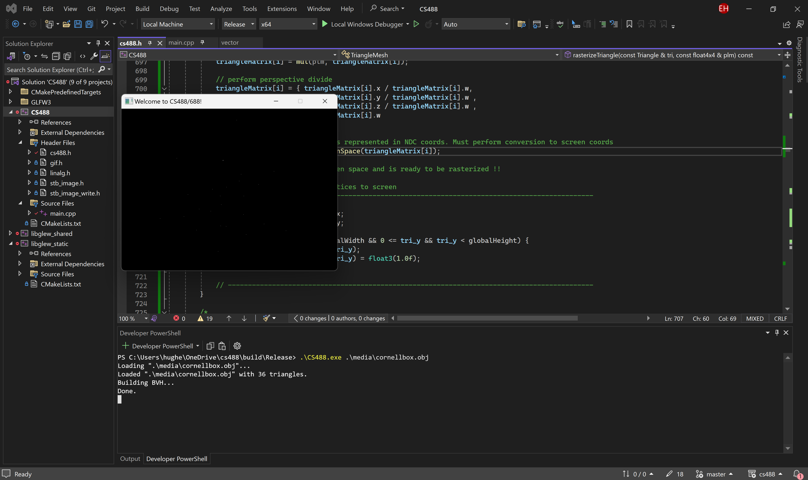
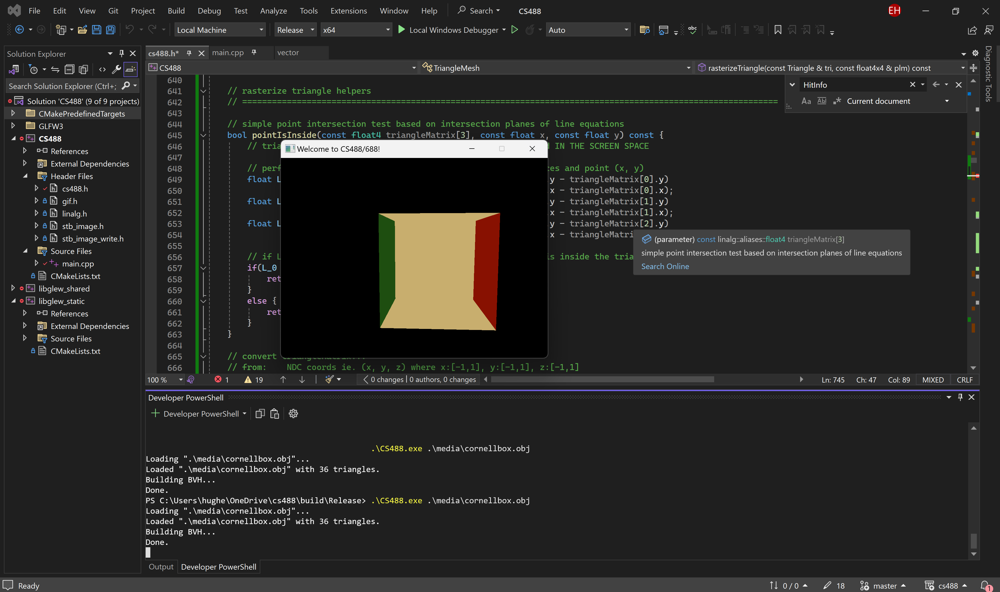
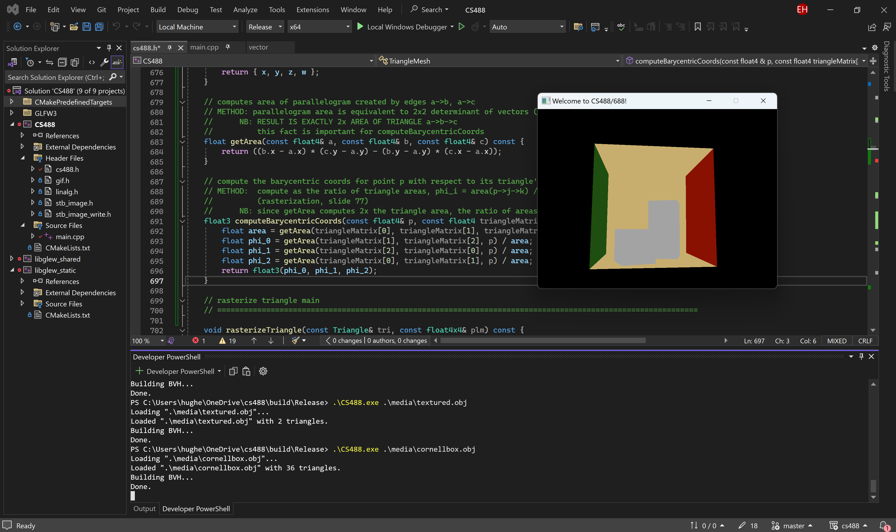
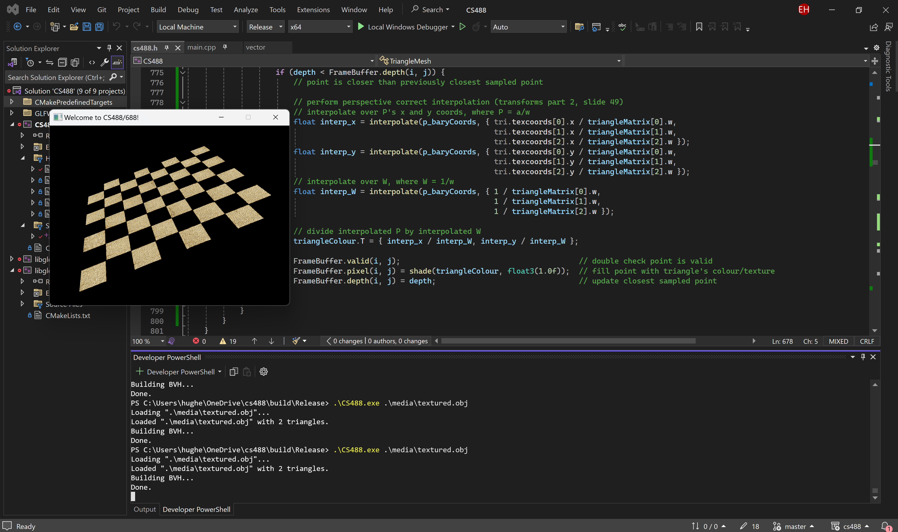
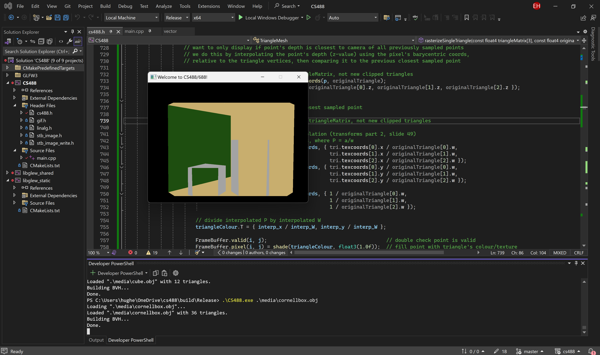
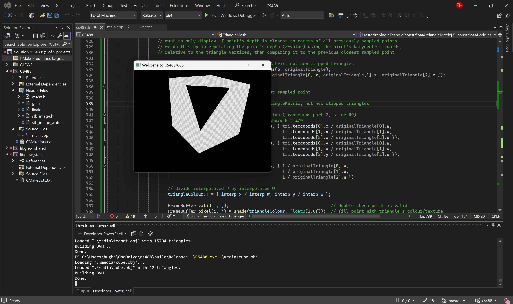

## 3D Rendering and Simple Physics Engine
### Euan Hughes (July 2024)

This project is a 3D rendering and simple physics engine, implemented fully in C++ (NO GRAPHICS APIS!!!)

Think of this as implementing core Graphics API functions *from scratch*.

#### Please email e5hughes@uwaterloo.ca to see source code

### Rasterizer:

1. Rasterize Points

2. Perform Point-in-Triangle Test

3. Implement Z-Buffer

4. Implement textures with perspective correct interpolation

5. Implement near-plane clipping

### Raytracer:

### Physics Engine:

